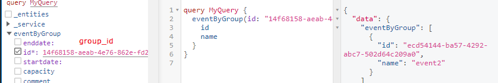

kopie do githubu
vlastni projekt-konkretni kontejner
vytvorit vedle gql_ug: gql_ug-kopie-"zkousky" a zde zacit praci

docker compose - pro spusteni
docker image - vyvtarime, zverejnime cele komunite
connectionstring

UUID pouzivat
    ma vyhody ale i nevyhody (nekompabilita s jinymi databazemi)

vazby mezi projekty (viz 1, 2, 6) - federace (odpoved z dilcich kontejneru) - umoznovat vazby - foreignkey - odkaz na "UUID"

definice pojmu:
    kontejner reprezentuje "zabalenou" aplikaci, je posazen vedle dalsich kontejneru, spolecne vytvari aplikaci
    localhost - muj pc

naplnit vzorovymi daty - daji se ulozit do jasonu a mit je porad stejna
    v DBFeeder radky 40, 311,....
    GraphTypeDefinitions - kdy se DBFeeder spousti (naplnuji se data)? funkce se vola pres GQL

gql_events - je "fake" doplnkovy - ukazuje federaci
    events2, vychazet ze vzoroveho projektu

strukturalizovat projekt do vice soubru: DBDef, DBFeed., GraphResolver - zkopírovat, GraphTypeDef. - gql modely, resolvery
v mainu se vytvari aplikace - řádek 73

pg admin:
    hostname, postgres všude

Projetkotvy den
kde je adresar, ukazat commit

Struktura graphql slozena z vice vsrtev
    databaze nad tim graphql + vsrtva apollo - prekryva endpointy, "lezi nad vsemi"

Scaling = škálovatelnost - 

uživatelské prostředí:
    localhost:port/gql

mutace = schopnost menit data v databazi
    create
    update (write)
    delete - zneplatneni
mutace relaci - ??

nakopírovat si modely v gql_events > main.py

smazat subject, prohodit vztah lesson */1 event

# Projektak
17 kontejneru

spoluprace s richterem
    musime se shodnout na nazvech EventGQL

# Alfa verze - 29.11.
Struktury databaze, modely, cteni z databaze (ne generovani nahodnych dat) 20 %

# 20.10.
gql_empty

# 26.10.
Proč nám nejde v pg adminu po compose up naše modely: Event, EventType
Jak zprovoznit jupyter? - Event, EventType - už se zobrazují, ale neaktualizují se
Nečitelné https://github.com/hrbolek/learning/blob/master/notebooks/inf/05B_sqlalchemy.ipynb

# projektový den 29.11.
localhost:31180/ui/api - API celého systému
               /api/nogql/utils/umlschema - schema celeho systemu

model který není zodpovědný vypadá jinak (extarnal)

# Beta verze - 12.01.
vyuzivat tu novou verzi na hrbolek github - GraphResolvers

v README.md jsou rady 

podle gql_ug > GTD
vytvorit editor EventEditorGQLModel, navazat na entitu 
    resolve_reference zkopirovat i s ID
    pridat atributy ID a result
    update zkopirovat krom Modelu a resolverUpdate...
    pridat metody update, insert atd.
    jestlize je lastchange, tak...?

    Editor bude jen jeden

# konzultace 19.01.

smazat lessonModel i v resolverech

frontend kontejner - stahnout a pridat do dockercompose
stahnout nginx.config z hrbolek

localhost:80/ui/api 

v jupyteru http request - na konci 05D:

import requests

query = """query {
    user(id: 1) {
        id
        name
        surname
        email
    }

    group(id: 1) {
        id
        name
    }
}"""
payload = {'query': query}
r = requests.post("http://localhost:9994/gql", json=payload)
result = r.json()

print(result)

http://apollo:3000/gql poslat request, da odpoved v jsonu

# po konzultaci

dosavadní postup ověřen přes pgadmin a GraphiQL - vše funkční

# TO DO:
DBFeeder
gql editory (mutace)
external_id
-	K primary key (ID) vždy přidružte external_id (indexed)
-	Primary key je typu UUID, external_id je string
docker image (na docker hub)
vygenerovaná dokumantace
příběh, deník

