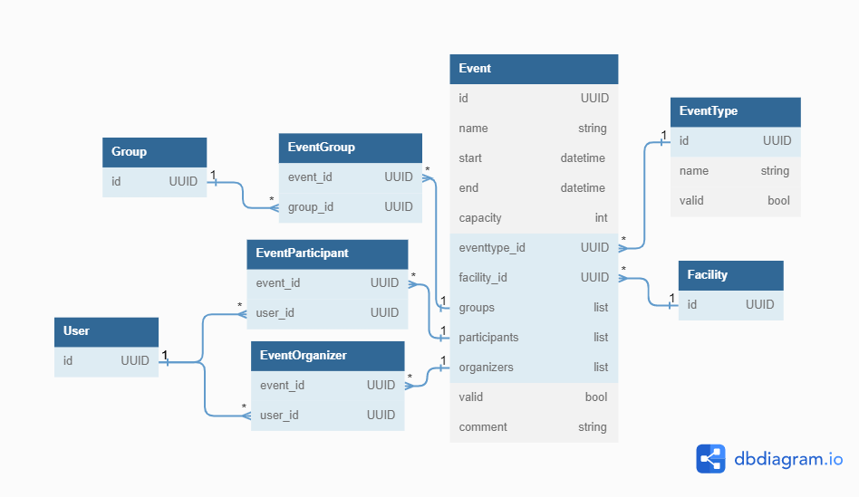

# Projekt č. 3
čet. Lenka Blažková, čet. Filip Zindler 
## Zadání
Vytvořte datové struktury pro definici:
- události
- typ události (výuka, zkouška, apod.)
- místa jejího konání (viz 2.)
- organizátorů (učitelé)
- účastníků (skupiny i jednotlivci) (viz 1.) 
neopomeňte vztah k předmětu, k lekci v předmětu (viz 7.).
## Struktura
Schéma:  

 

#
[DBDefinition](gql_events/gql_events/DBDefinitions.py)
- [pgAdmin](http://localhost:31122/browser/) - Tables

[DBFeeder](gql_events/gql_events/DBFeeder.py)
- [pgAdmin](http://localhost:31122/browser/) - View/Edit Data

#
[GraphResolvers](gql_events/gql_events/GraphResolvers.py)  
[GraphTypeDefinitons](gql_events/gql_events/GraphTypeDefinitions.py)
- [GraphiQL](http://localhost:31128/gql/)
    - eventPage   
    - eventById (show all atributes)
    - editor > update
    - editor > addOrganizer

